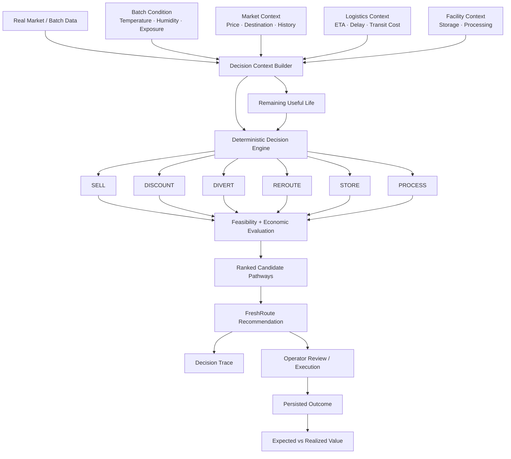

<div align="center">

# 🍅 FRESHROUTE

### AI-Powered Perishable Value Recovery Engine

**Perishability is a clock. FreshRoute decides what should happen to the batch next.**

[](https://nextjs.org/)
[](https://www.typescriptlang.org/)
[](https://tailwindcss.com/)
[](https://www.postgresql.org/)
[]()
[]()
[]()

<br/>

</div>

---

## `01` — Overview

**FreshRoute** is an AI-powered perishable value recovery engine designed to help operators decide what should happen to a perishable batch when its original plan no longer represents the best economic outcome.

Instead of treating condition, market price, logistics, and recovery options as separate dashboards, FreshRoute evaluates them together for a **single batch** and produces a ranked recovery decision.

> **Given this batch's current condition, remaining useful life, market state, logistics constraints, and available recovery pathways — what should happen to it next?**

FreshRoute currently evaluates six possible pathways:

```text
SELL
DISCOUNT
DIVERT
REROUTE
STORE
PROCESS
```

The system does **not** simply choose the market with the highest price.

A destination can have a higher price and still be economically infeasible because of transit time, remaining useful life, logistics cost, facility availability, execution constraints, or other pathway requirements.

The objective is therefore:

> **Maximize expected recoverable value while accounting for perishability, logistics, feasibility, and intervention cost.**

---

## `02` — Why FreshRoute Exists

Perishable supply chains operate against a continuously moving clock.

A batch can leave a collection centre with a reasonable destination and still encounter:

- thermal exposure
- transit delays
- changing market prices
- reduced remaining useful life
- unavailable buyers
- unavailable storage
- unavailable processing capacity
- increasing recovery costs

The problem is not only:

> **"Will this produce spoil?"**

The operational question is:

> **"Given what we know right now, is the original plan still the best way to recover value?"**

FreshRoute is built around that second question.

It acts as a **decision layer** between raw supply-chain signals and an operator's next action.

---

## `03` — What FreshRoute Is

FreshRoute is:

- a **per-batch decision engine**
- a **six-pathway recovery evaluator**
- a **remaining-useful-life-aware decision system**
- an **economic recovery ranking layer**
- a **provenance-aware operational interface**
- an **explainable decision-support system**
- an **operator-in-the-loop workflow**

FreshRoute is **not**:

- a spoilage predictor by itself
- a route optimizer by itself
- a market-price dashboard
- an autonomous execution system
- a production-calibrated ML model
- a generic LLM chatbot

The distinction matters.

FreshRoute consumes signals from condition, markets, logistics, and facilities and turns those signals into an economically ranked decision.

---

## `04` — System Architecture



### Architectural principle

The decision engine is intentionally isolated from the presentation layer.

```text
UI
 │
 ▼
Decision Context
 │
 ▼
Framework-free Engine
 │
 ├── Feasibility
 ├── Remaining Useful Life
 ├── Economic Evaluation
 ├── Pathway Ranking
 └── Recommendation
```

The engine does not depend on React, Next.js, database clients, or UI components.

This makes the core decision logic deterministic, testable, and independently verifiable.

---

## `05` — Decision Engine

At the centre of FreshRoute is a deterministic six-pathway evaluator.

Each candidate is evaluated against the current batch state rather than being assigned a hard-coded winner.

Conceptually:

```text
For each pathway:

    1. Determine whether the pathway is feasible
    2. Estimate remaining useful life through the pathway
    3. Determine realizable value
    4. Account for intervention / logistics costs
    5. Apply risk adjustments where applicable
    6. Produce an evaluated candidate
    7. Rank feasible candidates
```

The economic evaluation follows the project's recovery-value model:

```text
Expected Recovery
    =
Saleable Quantity
×
Realizable Price

− Transport Cost
− Handling Cost
− Storage Cost
− Processing Cost
− Risk Adjustment
```

The engine then compares candidates on a common economic scale.

### Important design constraint

**No pathway is hard-coded to win.**

The recommendation is produced from the current decision context and the resulting candidate evaluations.

---

## `06` — The Six Recovery Pathways

| Pathway | Purpose | Evidence Tier |
|---|---|---|
| `SELL` | Continue with the planned sale pathway | **Verified core** |
| `DISCOUNT` | Trade price for a faster / more viable sale | **Verified core** |
| `DIVERT` | Redirect the batch to another reachable market | **Verified core** |
| `REROUTE` | Change the destination or logistics plan | **Plausible — unverified** |
| `STORE` | Preserve optionality through storage | **Plausible — unverified** |
| `PROCESS` | Redirect produce into a processing pathway | **Plausible — unverified** |

The engine does not treat all six pathways as equally validated.

That distinction is visible throughout the product.

### Verified core

These pathways are supported by the stronger evidence available from the current Phase 0 research and data context.

### Plausible — unverified

These pathways are technically evaluated but depend on assumptions that require field validation.

For example:

```text
REROUTE
Execution rights require field validation.

STORE
No verified cold-storage facility is configured.

PROCESS
No verified processing facility is configured.
```

A plausible pathway can therefore participate in the decision engine without being presented as field-proven.

---

## `07` — Remaining Useful Life

FreshRoute does not treat remaining useful life as a single static number shared by every pathway.

Instead, useful life is evaluated through the conditions associated with the candidate pathway.

Conceptually:

```text
Current State
     │
     ▼
Thermal / Condition Exposure
     │
     ▼
Hold Time
     │
     ▼
Transit Time
     │
     ▼
Market / Destination Dwell
     │
     ▼
Pathway-specific Remaining Useful Life
```

This matters because two pathways can expose the same batch to very different future conditions.

A route with a higher nominal selling price may therefore produce less recoverable value if the additional transit and exposure push the batch beyond its viable window.

---

## `08` — Thermal Decay Model

FreshRoute incorporates thermal exposure into the remaining-useful-life calculation.

The model uses a Q10-based thermal relationship to represent temperature-dependent decay.

The implementation deliberately distinguishes:

- **reference temperature**
- **respiration-rate Q10**
- **quality-loss approximation**

The current Q10 value is used as a **respiration-rate proxy for quality-loss kinetics**.

It is **not** presented as a tomato-specific experimentally calibrated quality-loss Q10.

This distinction is preserved because scientific assumptions should remain visible rather than being presented as measured facts.

The model also handles chilling exposure separately rather than blindly applying an exponential decay model below the chilling threshold.

---

## `09` — Feasibility Before Optimization

FreshRoute does not simply ask:

> "Which pathway has the highest expected recovery?"

It asks:

> **"Which pathways can actually be executed under the current context, and which feasible pathway preserves the most value?"**

A candidate can therefore be:

```text
FEASIBLE
```

or:

```text
INFEASIBLE
```

with an explicit reason.

Examples:

```text
SELL
RUL falls below the viability threshold.

DIVERT
No reachable secondary buyer is configured.

REROUTE
Execution rights require field validation.

STORE
No cold-store facility is configured.

PROCESS
No processing facility is configured.
```

This prevents an attractive but operationally impossible option from becoming the recommendation.

---

## `10` — NO-PATHWAY Is a First-Class Decision

One of the most important behaviours in FreshRoute is that the engine can legitimately refuse to recommend a recovery pathway.

```text
                 Evaluate all six
                       │
          ┌────────────┴────────────┐
          │                         │
       FEASIBLE                 INFEASIBLE
          │                         │
          ▼                         ▼
      Rank by value            Explain why
          │                         │
          └────────────┬────────────┘
                       ▼
              Recommendation
                       │
                 none feasible
                       │
                       ▼
              NO FEASIBLE PATHWAY
```

When no pathway is feasible, FreshRoute does not fabricate a fallback recommendation.

Instead, the operator sees:

1. **No feasible pathway**
2. the reason for the refusal
3. all six evaluated pathways
4. each pathway's feasibility state
5. each pathway's evidence tier
6. the relevant economic state
7. the next decision window
8. an explicit operator-review boundary

The result is a **decision refusal with reasons**, not an empty error state.

This is intentional.

---

## `11` — Explainability & Decision Trace

Every recommendation is accompanied by structured reasoning.

The interface surfaces:

- selected pathway
- expected recoverable value
- baseline/current-plan value
- uplift where applicable
- remaining useful life
- market context
- logistics constraints
- feasibility state
- evidence tier
- assumption flags
- decision reasons
- provenance

A deeper **Decision Trace** provides the underlying reasoning chain.

The system does not replace engine-generated reasoning with generic UI copy when the original reason is available.

This keeps the explanation tied to the actual evaluated state.

---

## `12` — Data Provenance

FreshRoute distinguishes between different levels of data confidence.

The product explicitly surfaces whether information is:

```text
REAL
```

or:

```text
SIMULATED / INDICATIVE
```

and distinguishes evidence strength:

```text
VERIFIED CORE
```

from:

```text
PLAUSIBLE — UNVERIFIED
```

This is especially important for operational decisions.

A high market price should not look equivalent to a field-verified execution pathway if the underlying evidence is materially different.

### Current market-data context

The Stage 0 system includes real Tamil Nadu market-price data and persisted decision context.

The current dataset contains more than **115,000 market rows**, with market prices carried through the decision-context layer.

However, the current market archive does **not** provide a verified demand/arrivals signal.

Therefore FreshRoute does not present an absent demand signal as observed market demand.

---

## `13` — Economic Risk

FreshRoute separates current economic exposure from future-loss forecasting.

The interface can show a current-state value gap between:

```text
Undecayed market value
        vs.
Recoverable value today
```

This is intentionally described as a **current-state value gap**.

It is not presented as:

```text
"₹X will definitely be lost"
```

or as a calibrated future-loss prediction.

This distinction prevents the UI from turning an accounting/reference comparison into an unsupported forecast.

---

## `14` — Operator-in-the-Loop

FreshRoute is decision support, not autonomous execution.

The workflow is:

```text
FreshRoute evaluates
        │
        ▼
FreshRoute recommends
        │
        ▼
Operator reviews
        │
        ▼
Operator accepts / rejects / overrides
        │
        ▼
Outcome is recorded
```

The system explicitly communicates:

> **Operator reviews and executes. FreshRoute does not execute pathways automatically.**

This keeps operational authority with the human operator.

---

## `15` — Outcome Loop

FreshRoute persists execution outcomes so that expected and realized economics can eventually be compared.

```text
Recommendation
      │
      ▼
Expected Recovery
      │
      ▼
Operator Decision
      │
      ▼
Realized Outcome
      │
      ▼
Expected vs Realized
```

The current outcome dataset is intentionally treated as **early / sparse data**.

The current persisted outcome evidence includes:

```text
Expected recovery : ₹50,265.83
Realized recovery : ₹48,900.50
Difference        : -₹1,365.33
Sample size       : n=1
```

This is not presented as fleet-wide performance.

The purpose at this stage is to establish the **mechanism for outcome tracking and evaluation**, which can support stronger empirical validation as more real outcomes are collected.

---

## `16` — Stage 0 Data Reality

FreshRoute currently combines real and simulated/indicative context.

### Real / persisted

- Tamil Nadu market-price data
- persisted batch records
- persisted recommendations
- persisted candidate evaluations
- persisted operator outcomes
- market-price history
- decision provenance
- quality-score state

### Current infrastructure context

The system currently has:

```text
115,538+ real market rows
147 storage facilities
4 processing facilities
```

Facility economics are not yet populated sufficiently to claim field-validated economics for every storage or processing pathway.

Consequently, those pathways are filtered or marked according to their actual available evidence rather than being artificially enabled.

---

## `17` — Validation

The decision engine is deterministic and scenario-tested.

Current Stage 0 scenario validation covers four representative outcomes:

| Scenario | Winner |
|---|---|
| Healthy / baseline | `SELL` |
| Market opportunity | `DIVERT` |
| Reroute opportunity | `REROUTE` |
| No viable recovery option | `NONE` |

The scenario suite verifies:

- expected winners remain stable
- ranking is deterministic
- margins remain consistent
- feasibility constraints are respected
- no pathway is hard-coded as the winner
- the engine remains unchanged during UI refinement work

The UI also preserves the distinction between:

```text
SIMULATION-LIMITED
```

and a calibrated statistical confidence.

FreshRoute does **not** claim production-calibrated confidence from the current dataset.

---

## `18` — Product Workflow

The primary reviewer flow is:

```text
Dashboard
    │
    ▼
Active Batches
    │
    ▼
Batch Workspace
    │
    ├── Condition
    ├── Market Intelligence
    ├── Logistics
    ├── Economic Risk
    └── Remaining Useful Life
            │
            ▼
      Value Recovery Engine
            │
            ▼
      Ranked Pathways
            │
            ▼
       Recommendation
            │
            ▼
       Decision Trace
            │
            ▼
      Operator Action
            │
            ▼
        Outcome
```

The central interaction is not browsing dashboards.

It is answering:

> **What should happen to this batch next?**

---

## `19` — Tech Stack

### Application

- Next.js
- React
- TypeScript
- Tailwind CSS
- shadcn/ui

### Decision Layer

- Framework-free TypeScript
- deterministic pathway evaluation
- typed decision contracts
- pathway-specific RUL calculations
- feasibility evaluation
- economic ranking
- evidence-tier handling

### Data Layer

- PostgreSQL
- Drizzle ORM / schema layer
- real market-data ingestion
- persisted batch state
- persisted recommendations
- persisted outcomes

### Visualization

- Recharts where a visualization genuinely improves decision comprehension
- lightweight SVG visualizations
- responsive operational interface

### Deployment

- Vercel
- GitHub

---

## `20` — Repository Structure

```text
freshroute/
│
├── src/
│   ├── app/
│   │   ├── dashboard/
│   │   ├── batches/
│   │   └── decisions/
│   │
│   ├── components/
│   │   ├── batch/
│   │   ├── decision/
│   │   ├── market/
│   │   ├── shell/
│   │   └── shared/
│   │
│   ├── domain/
│   │   ├── engine/
│   │   │   ├── evaluateDecision
│   │   │   ├── sell
│   │   │   ├── discount
│   │   │   ├── divert
│   │   │   ├── reroute
│   │   │   ├── store
│   │   │   ├── process
│   │   │   └── rul
│   │   │
│   │   └── types/
│   │
│   ├── domain-adapters/
│   │   └── decision-context/
│   │
│   ├── db/
│   │   ├── schema/
│   │   └── migrations/
│   │
│   └── demo/
│       ├── data/
│       └── scenarios/
│
├── scripts/
│   └── scenario / validation utilities
│
├── docs/
│   └── research / architecture / UI decisions
│
├── public/
├── package.json
└── README.md
```

---

## `21` — Running Locally

### Clone

```bash
git clone https://github.com/sheshakanthra/FreshRoute.git
cd FreshRoute
```

### Install dependencies

```bash
npm install
```

### Start development server

```bash
npm run dev
```

Open:

```text
http://localhost:3000
```

### Production build

```bash
npm run build
```

### Lint

```bash
npm run lint
```

### Scenario validation

```bash
npx tsx scripts/test-scenarios.ts
```

---

## `22` — Current Limitations

FreshRoute is a Stage 0 / research-grade operational prototype.

Important limitations are intentionally disclosed.

### Data

- Live telemetry integrations are not yet connected.
- Market data is real but the current product context does not establish live demand/arrivals intelligence.
- Facility economics are incomplete.
- Some logistics values remain indicative.

### Model

- Confidence is **simulation-limited**, not calibrated probability.
- Thermal decay uses a respiration-rate Q10 as a proxy for quality-loss kinetics.
- The current thermal parameters are not a substitute for tomato-specific experimental calibration.
- Economic estimates are decision-model outputs, not guaranteed realized returns.

### Evidence

- `SELL`, `DISCOUNT`, and `DIVERT` are currently treated as the verified core.
- `REROUTE`, `STORE`, and `PROCESS` remain plausible but require field validation.
- A pathway being mathematically attractive does not automatically make it operationally executable.

### Outcomes

- Outcome tracking is established, but the current observed outcome sample is still **n=1**.
- No fleet-wide recovery or loss-reduction claim should be inferred from the current sample.

---

## `23` — Design Principles

FreshRoute's interface follows a simple operational hierarchy:

```text
STATE / RISK
      ↓
RECOMMENDATION
      ↓
WHY
      ↓
ACTION
```

The interface is deliberately designed as an operational instrument rather than a generic AI dashboard.

### Core principles

**1. Numbers are the product.**

RUL, recoverable value, market price, transit time, cost, and economic gap should be immediately legible.

**2. Evidence is visible.**

Verified information and plausible assumptions should never look identical.

**3. Refusal is a valid result.**

If no pathway is feasible, FreshRoute says so.

**4. Every recommendation needs a reason.**

The operator should be able to understand why the system reached its conclusion.

**5. Humans retain execution authority.**

FreshRoute recommends; the operator decides and executes.

**6. No decorative AI effects.**

The interface prioritizes information density, hierarchy, operational clarity, and semantic visual language over generic AI aesthetics.

---

## `24` — Roadmap

The current Stage 0 establishes the decision layer and its supporting operational workflow.

Future development can extend the system toward:

```text
Stage 1
│
├── Field telemetry integrations
├── Verified facility data
├── Live market integrations
└── Better logistics data
        │
        ▼
Stage 2
│
├── Field validation of REROUTE / STORE / PROCESS
├── Larger outcome dataset
├── Calibration against realized outcomes
└── Improved economic models
        │
        ▼
Stage 3
│
├── Multi-crop support
├── richer demand intelligence
├── routing / tariff integration
└── production deployment
```

These are future directions, not capabilities currently claimed by the Stage 0 system.

---

## `25` — Why This Architecture Matters

FreshRoute deliberately separates **prediction, data, decision, and execution**.

The system does not need to predict every future event perfectly to provide value.

Instead, it repeatedly asks:

```text
What do we know?
        ↓
What is changing?
        ↓
What pathways are actually feasible?
        ↓
What value can still be recovered?
        ↓
What should happen next?
```

That makes FreshRoute a **decision layer for perishable operations**, rather than another isolated analytics dashboard.

---

## `26` — Project Status

**Stage 0 — Data + Decision Engine + Operational UI**

Current capabilities include:

- Real market-data context
- Persistent batch state
- Deterministic decision engine
- Six-pathway evaluation
- Pathway-specific RUL
- Thermal exposure modelling
- Quality scoring
- Economic-risk presentation
- Evidence tiers
- Data provenance
- Decision trace
- NO-PATHWAY state
- Operator accept / reject / override workflow
- Persisted outcome tracking
- Expected vs realized value comparison
- Dashboard / batch / decisions workflow
- Responsive operational UI

The system is currently positioned as a **research-grade, decision-support prototype**, with field validation and production integrations intentionally left for subsequent stages.

---


### Initial focus

```text
Crop
    ↓
Tomato

Region
    ↓
Tamil Nadu

Target operators
    ↓
FPOs
Collection Centres
Aggregators
Cold-chain Operators
Processors
```

---

## `28` — Live Demo

### Product

**FreshRoute — Value Recovery Decision Layer**


The live demo demonstrates the operational decision workflow:

```text
Batch
  ↓
Condition
  ↓
Market
  ↓
Logistics
  ↓
Economic exposure
  ↓
Six-pathway evaluation
  ↓
Recommendation / NO-PATHWAY
  ↓
Operator decision
  ↓
Outcome
```

---

<div align="center">

### FreshRoute

**Perishability is a clock.**

**The question is not only what the batch is worth.  
It is what the batch can still become.**


</div>


And the website field should be:

d-freshroute.vercel.app

That will make the repo landing page immediately communicate **what FreshRoute actually is**, instead of just saying "AI agriculture project."
